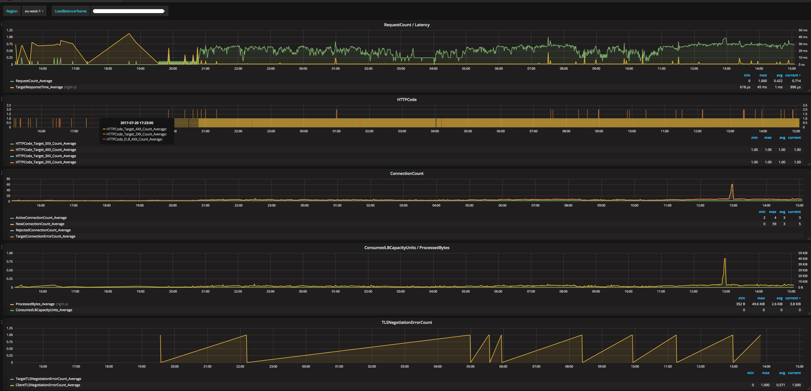

[](http://www.monitoringartist.com 'DevOps / Docker / Kubernetes / AWS ECS / Zabbix / Zenoss / Terraform / Monitoring')

# Grafana dashboards for AWS CloudWatch

Set of AWS Grafana dashboards published on
[grafana.com](https://grafana.com/dashboards?dataSource=cloudwatch) -
20k+ downloads.

Doc:
- [Cloudwatch datasource configuration](http://docs.grafana.org/datasources/cloudwatch/)
- [Grafana doc](http://docs.grafana.org/)

Feel free to create pull request for additional AWS resources/printscreens/...

Please set your dashboard variables (`Region, ...`) after dashboard import.
Empty dashboard variables are reason of initial *"Unable to call AWS API" or "Metric request error"* error.

Import all Monitoring Artist AWS dashboards in one go (example script,
`bash/curl/jq` required):

```bash
#!/bin/bash
### Please edit grafana_* variables to match your Grafana setup:
grafana_host="http://localhost:3000"
grafana_cred="admin:admin"
grafana_datasource="cloudwatch"
ds=(1516 677 139 674 590 659 758 623 617 551 653 969 650 644 607 593 707 575 1519 581 584 2969 8050);
for d in "${ds[@]}"; do
  echo -n "Processing $d: "
  j=$(curl -s -k -u "$grafana_cred" $grafana_host/api/gnet/dashboards/$d | jq .json)
  curl -s -k -u "$grafana_cred" -XPOST -H "Accept: application/json" \
    -H "Content-Type: application/json" \
    -d "{\"dashboard\":$j,\"overwrite\":true, \
        \"inputs\":[{\"name\":\"DS_CLOUDWATCH\",\"type\":\"datasource\", \
        \"pluginId\":\"cloudwatch\",\"value\":\"$grafana_datasource\"}]}" \
    $grafana_host/api/dashboards/import; echo ""
done
```

Use [AWS Policy Generator](http://awspolicygen.s3.amazonaws.com/policygen.html),
which fits your needs. Example of minimal IAM role for Grafana (CloudWatch + EC2 metrics):

```
{
    "Version": "2012-10-17",
    "Statement": [
        {
            "Sid": "AllowReadingMetricsFromCloudWatch",
            "Effect": "Allow",
            "Action": [
                "cloudwatch:ListMetrics",
                "cloudwatch:GetMetricStatistics"
            ],
            "Resource": "*"
        },
        {
            "Sid": "AllowReadingTagsFromEC2",
            "Effect": "Allow",
            "Action": [
                "ec2:DescribeTags",
                "ec2:DescribeInstances"
            ],
            "Resource": "*"
        }
    ]
}
```

### [AWS API Gateway](https://github.com/monitoringartist/grafana-aws-cloudwatch-dashboards/tree/master/aws-api-gateway)
[](https://github.com/monitoringartist/grafana-aws-cloudwatch-dashboards/tree/master/aws-api-gateway)

### [AWS Auto Scaling](https://github.com/monitoringartist/grafana-aws-cloudwatch-dashboards/tree/master/aws-autoscaling)

### [AWS Billing](https://github.com/monitoringartist/grafana-aws-cloudwatch-dashboards/tree/master/aws-billing)
[](https://github.com/monitoringartist/grafana-aws-cloudwatch-dashboards/tree/master/aws-billing)

### [AWS CloudFront](https://github.com/monitoringartist/grafana-aws-cloudwatch-dashboards/tree/master/aws-cloudfront)

### [AWS CloudWatch Browser](https://github.com/monitoringartist/grafana-aws-cloudwatch-dashboards/tree/master/aws-cloudwatch-browser)
[](https://github.com/monitoringartist/grafana-aws-cloudwatch-dashboards/tree/master/aws-cloudwatch-browser)

### [AWS EBS](https://github.com/monitoringartist/grafana-aws-cloudwatch-dashboards/tree/master/aws-ebs)
[](https://github.com/monitoringartist/grafana-aws-cloudwatch-dashboards/tree/master/aws-ebs)

### [AWS EC2](https://github.com/monitoringartist/grafana-aws-cloudwatch-dashboards/tree/master/aws-ec2)
[](https://github.com/monitoringartist/grafana-aws-cloudwatch-dashboards/tree/master/aws-ec2)

### [AWS ECS](https://github.com/monitoringartist/grafana-aws-cloudwatch-dashboards/tree/master/aws-ecs)

### [AWS EFS](https://github.com/monitoringartist/grafana-aws-cloudwatch-dashboards/tree/master/aws-efs)
[](https://github.com/monitoringartist/grafana-aws-cloudwatch-dashboards/tree/master/aws-efs)

### [AWS ElastiCache Redis](https://github.com/monitoringartist/grafana-aws-cloudwatch-dashboards/tree/master/aws-elasticache)
[](https://github.com/monitoringartist/grafana-aws-cloudwatch-dashboards/tree/master/aws-elasticache)

### [AWS ELB Classic Load Balancer](https://github.com/monitoringartist/grafana-aws-cloudwatch-dashboards/tree/master/aws-elb)
[](https://github.com/monitoringartist/grafana-aws-cloudwatch-dashboards/tree/master/aws-elb)

### [AWS ELB Application Load Balancer](https://github.com/monitoringartist/grafana-aws-cloudwatch-dashboards/tree/master/aws-elb)
[](https://github.com/monitoringartist/grafana-aws-cloudwatch-dashboards/tree/master/aws-elb)

### [AWS EMR Hadoop 2](https://github.com/monitoringartist/grafana-aws-cloudwatch-dashboards/tree/master/aws-emr)
[](https://github.com/monitoringartist/grafana-aws-cloudwatch-dashboards/tree/master/aws-emr)

### [AWS Events](https://github.com/monitoringartist/grafana-aws-cloudwatch-dashboards/tree/master/aws-events)
[](https://github.com/monitoringartist/grafana-aws-cloudwatch-dashboards/tree/master/aws-events)

### [AWS Lambda](https://github.com/monitoringartist/grafana-aws-cloudwatch-dashboards/tree/master/aws-lambda)
[](https://github.com/monitoringartist/grafana-aws-cloudwatch-dashboards/tree/master/aws-lambda)

### [AWS Logs](https://github.com/monitoringartist/grafana-aws-cloudwatch-dashboards/tree/master/aws-logs)
[](https://github.com/monitoringartist/grafana-aws-cloudwatch-dashboards/tree/master/aws-logs)

### [AWS RDS](https://github.com/monitoringartist/grafana-aws-cloudwatch-dashboards/tree/master/aws-rds)

### [AWS Redshift](https://github.com/monitoringartist/grafana-aws-cloudwatch-dashboards/tree/master/aws-redshift)

### [AWS S3](https://github.com/monitoringartist/grafana-aws-cloudwatch-dashboards/tree/master/aws-s3)
[](https://github.com/monitoringartist/grafana-aws-cloudwatch-dashboards/tree/master/aws-s3)

### [AWS SES](https://github.com/monitoringartist/grafana-aws-cloudwatch-dashboards/tree/master/aws-ses)

### [AWS SNS](https://github.com/monitoringartist/grafana-aws-cloudwatch-dashboards/tree/master/aws-sns)
[](https://github.com/monitoringartist/grafana-aws-cloudwatch-dashboards/tree/master/aws-sns)

### [AWS SQS](https://github.com/monitoringartist/grafana-aws-cloudwatch-dashboards/tree/master/aws-sqs)
[](https://github.com/monitoringartist/grafana-aws-cloudwatch-dashboards/tree/master/aws-sqs)

### [AWS VPN](https://github.com/monitoringartist/grafana-aws-cloudwatch-dashboards/tree/master/aws-vpn)

# Author

[Devops Monitoring Expert](http://www.jangaraj.com 'DevOps / Docker / Kubernetes / AWS ECS / Google GCP / Zabbix / Zenoss / Terraform / Monitoring'),
who loves monitoring systems and cutting/bleeding edge technologies: Docker,
Kubernetes, ECS, AWS, Google GCP, Terraform, Lambda, Zabbix, Grafana, Elasticsearch,
Kibana, Prometheus, Sysdig,...

Summary:
* 2000+ [GitHub](https://github.com/monitoringartist/) stars
* 15 000+ [Grafana dashboard](https://grafana.net/monitoringartist) downloads
* 1 000 000+ [Docker image](https://hub.docker.com/u/monitoringartist/) pulls

Professional devops / monitoring / consulting services:

[](http://www.monitoringartist.com 'DevOps / Docker / Kubernetes / AWS ECS / Google GCP / Zabbix / Zenoss / Terraform / Monitoring')
