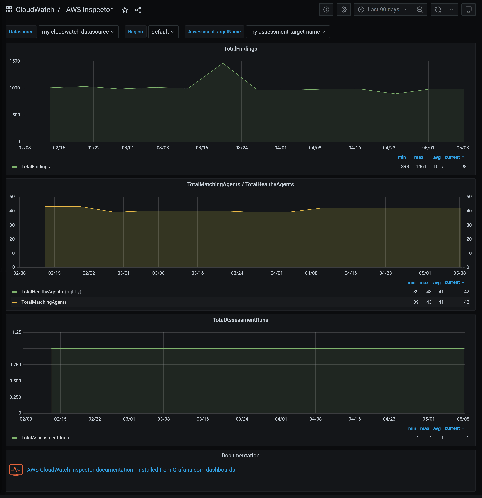
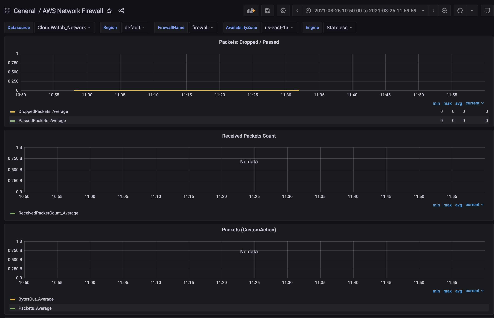
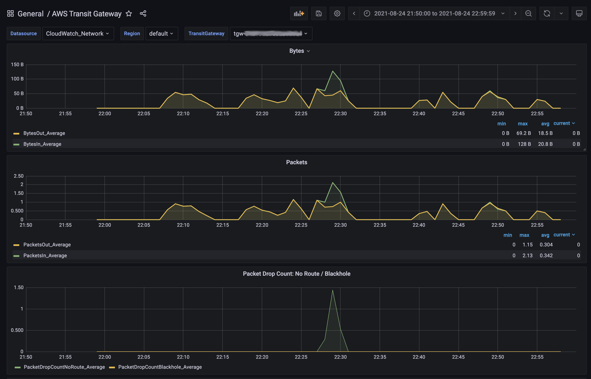

[](http://www.monitoringartist.com 'DevOps / Docker / Kubernetes / AWS ECS / Zabbix / Zenoss / Terraform / Monitoring')

# Grafana dashboards for AWS CloudWatch

Set of AWS Grafana dashboards published on
[grafana.com](https://grafana.com/dashboards?dataSource=cloudwatch) -
10M+ downloads.

Doc:
- [Cloudwatch datasource configuration](https://grafana.com/docs/grafana/latest/datasources/cloudwatch/)
- [Grafana doc](https://grafana.com/docs/)

Feel free to create pull request for additional AWS resources/printscreens/...

Please set your dashboard variables (`Region, ...`) after dashboard import.
Empty dashboard variables are reason of initial *"Unable to call AWS API" or "Metric request error"* error.

Import all Monitoring Artist AWS dashboards in one go (example script,
`bash/curl/jq` required):

```bash
#!/bin/bash
jq --version >/dev/null 2>&1 || { echo >&2 "I require jq but it's not installed. Aborting."; exit 1; }
### Please edit grafana_* variables to match your Grafana setup:
grafana_host="http://localhost:3000"
grafana_cred="admin:admin"
# Keep grafana_folder empty for adding the dashboards in "General" folder
grafana_folder="AWS CloudWatch"
ds=(1516 677 139 674 659 758 623 617 551 653 969 650 644 607 593 707 575 1519 581 584 2969 8050 11099 11154 11155 12979 13018 13040 13104 13892 14189 14391 14392 14954 14955 15016 16899 17741 17978 20007 20008 20009 20144);
folderId=$(curl -s -k -u "$grafana_cred" $grafana_host/api/folders | jq -r --arg grafana_folder  "$grafana_folder" '.[] | select(.title==$grafana_folder).id')
if [ -z "$folderId" ] ; then echo "Didn't get folderId" ; else echo "Got folderId $folderId" ; fi
for d in "${ds[@]}"; do
  echo -n "Processing $d: "
  j=$(curl -s -k -u "$grafana_cred" $grafana_host/api/gnet/dashboards/$d | jq .json)
  payload="{\"dashboard\":$j,\"overwrite\":true"
  if [ ! -z "$folderId" ] ; then payload="${payload}, \"folderId\": $folderId }";  else payload="${payload} }" ; fi
  curl -s -k -u "$grafana_cred" -XPOST -H "Accept: application/json" \
    -H "Content-Type: application/json" \
    -d "$payload" \
    $grafana_host/api/dashboards/import; echo ""
done
```

Use [AWS Policy Generator](http://awspolicygen.s3.amazonaws.com/policygen.html),
which fits your needs. Example of minimal IAM role for Grafana (CloudWatch + EC2 metrics):

```
{
    "Version": "2012-10-17",
    "Statement": [
        {
            "Sid": "AllowReadingMetricsFromCloudWatch",
            "Effect": "Allow",
            "Action": [
                "cloudwatch:DescribeAlarmsForMetric",
                "cloudwatch:DescribeAlarmHistory",
                "cloudwatch:DescribeAlarms",
                "cloudwatch:ListMetrics",
                "cloudwatch:GetMetricStatistics",
                "cloudwatch:GetMetricData"
            ],
            "Resource": "*"
        },
        {
            "Sid": "AllowReadingTagsInstancesRegionsFromEC2",
            "Effect": "Allow",
            "Action": [
                "ec2:DescribeTags",
                "ec2:DescribeInstances",
                "ec2:DescribeRegions"
            ],
            "Resource": "*"
        },
        {
            "Sid": "AllowReadingResourcesForTags",
            "Effect" : "Allow",
            "Action" : "tag:GetResources",
            "Resource" : "*"
        }
    ]
}
```
See https://github.com/monitoringartist/grafana-cross-account-cloudwatch-access for AWS cross account access.

You can also install this project as a Jsonnet library with [jsonnet-bundler](https://github.com/jsonnet-bundler/jsonnet-bundler):

```shell
$ jb install github.com/monitoringartist/grafana-aws-cloudwatch-dashboards
$ cat > aws-cloudwatch-dashboards.jsonnet <<EOF
local awsCloudWatch = import 'github.com/monitoringartist/grafana-aws-cloudwatch-dashboards/dashboards.libsonnet';

awsCloudWatch.grafanaDashboards
EOF
$ jsonnet -J vendor aws-cloudwatch-dashboards.jsonnet
```

Single click provisioning [](https://gitpod.io/#https://github.com/monitoringartist/grafana-aws-cloudwatch-dashboards/) - login as `admin/admin` and create CloudWatch datasource from your `Access & secret key` to see all dashboards with your data.

### [AWS API Gateway](https://github.com/monitoringartist/grafana-aws-cloudwatch-dashboards/tree/master/aws-api-gateway)
[](https://github.com/monitoringartist/grafana-aws-cloudwatch-dashboards/tree/master/aws-api-gateway)

### [AWS Auto Scaling](https://github.com/monitoringartist/grafana-aws-cloudwatch-dashboards/tree/master/aws-autoscaling)
[](https://github.com/monitoringartist/grafana-aws-cloudwatch-dashboards/tree/master/aws-autoscaling)

### [AWS Billing](https://github.com/monitoringartist/grafana-aws-cloudwatch-dashboards/tree/master/aws-billing)
[](https://github.com/monitoringartist/grafana-aws-cloudwatch-dashboards/tree/master/aws-billing)

### [AWS Certificate Manager](https://github.com/monitoringartist/grafana-aws-cloudwatch-dashboards/tree/master/aws-certificate-manager)
[](https://github.com/monitoringartist/grafana-aws-cloudwatch-dashboards/tree/master/aws-certificate-manager)

### [AWS CloudFront](https://github.com/monitoringartist/grafana-aws-cloudwatch-dashboards/tree/master/aws-cloudfront)
[](https://github.com/monitoringartist/grafana-aws-cloudwatch-dashboards/tree/master/aws-cloudfront)

### [AWS CloudWatch Synthetics](https://github.com/monitoringartist/grafana-aws-cloudwatch-dashboards/tree/master/aws-cloudwatch-synthetics)
[](https://github.com/monitoringartist/grafana-aws-cloudwatch-dashboards/tree/master/aws-cloudwatch-synthetics)

### [AWS CloudWatch Usage Metrics](https://github.com/monitoringartist/grafana-aws-cloudwatch-dashboards/tree/master/aws-cloudwatch-usage-metrics)
[](https://github.com/monitoringartist/grafana-aws-cloudwatch-dashboards/tree/master/aws-cloudwatch-usage-metrics)

### [AWS CodeBuild](https://github.com/monitoringartist/grafana-aws-cloudwatch-dashboards/tree/master/aws-codebuild)
[](https://github.com/monitoringartist/grafana-aws-cloudwatch-dashboards/tree/master/aws-codebuild)

### [AWS Cognito](https://github.com/monitoringartist/grafana-aws-cloudwatch-dashboards/tree/master/aws-cognito)
[](https://github.com/monitoringartist/grafana-aws-cloudwatch-dashboards/tree/master/aws-cognito)

### [AWS Direct Connect](https://github.com/monitoringartist/grafana-aws-cloudwatch-dashboards/tree/master/aws-direct-connect)
[](https://github.com/monitoringartist/grafana-aws-cloudwatch-dashboards/tree/master/aws-direct-connect)

### [AWS DynamoDB](https://github.com/monitoringartist/grafana-aws-cloudwatch-dashboards/tree/master/aws-dynamodb)
[](https://github.com/monitoringartist/grafana-aws-cloudwatch-dashboards/tree/master/aws-dynamodb)

### [AWS EBS](https://github.com/monitoringartist/grafana-aws-cloudwatch-dashboards/tree/master/aws-ebs)
[](https://github.com/monitoringartist/grafana-aws-cloudwatch-dashboards/tree/master/aws-ebs)

### [AWS EC2](https://github.com/monitoringartist/grafana-aws-cloudwatch-dashboards/tree/master/aws-ec2)
[](https://github.com/monitoringartist/grafana-aws-cloudwatch-dashboards/tree/master/aws-ec2)

### [AWS ECS](https://github.com/monitoringartist/grafana-aws-cloudwatch-dashboards/tree/master/aws-ecs)
[](https://github.com/monitoringartist/grafana-aws-cloudwatch-dashboards/tree/master/aws-ecs)

### [AWS EFS](https://github.com/monitoringartist/grafana-aws-cloudwatch-dashboards/tree/master/aws-efs)
[](https://github.com/monitoringartist/grafana-aws-cloudwatch-dashboards/tree/master/aws-efs)

### [AWS EKS](https://github.com/monitoringartist/grafana-aws-cloudwatch-dashboards/tree/master/aws-eks)

### [AWS ElastiCache Redis](https://github.com/monitoringartist/grafana-aws-cloudwatch-dashboards/tree/master/aws-elasticache)
[](https://github.com/monitoringartist/grafana-aws-cloudwatch-dashboards/tree/master/aws-elasticache)

### [AWS ELB Classic Load Balancer](https://github.com/monitoringartist/grafana-aws-cloudwatch-dashboards/tree/master/aws-elb)
[](https://github.com/monitoringartist/grafana-aws-cloudwatch-dashboards/tree/master/aws-elb)

### [AWS ELB Application Load Balancer](https://github.com/monitoringartist/grafana-aws-cloudwatch-dashboards/tree/master/aws-elb)
[](https://github.com/monitoringartist/grafana-aws-cloudwatch-dashboards/tree/master/aws-elb)

### [AWS EMR Hadoop 2](https://github.com/monitoringartist/grafana-aws-cloudwatch-dashboards/tree/master/aws-emr)
[](https://github.com/monitoringartist/grafana-aws-cloudwatch-dashboards/tree/master/aws-emr)

### [AWS Eventbridge](https://github.com/monitoringartist/grafana-aws-cloudwatch-dashboards/tree/master/aws-eventbridge)
[](https://github.com/monitoringartist/grafana-aws-cloudwatch-dashboards/tree/master/aws-eventbridge)

### [AWS FSx](https://github.com/monitoringartist/grafana-aws-cloudwatch-dashboards/tree/master/aws-fsx)
[](https://github.com/monitoringartist/grafana-aws-cloudwatch-dashboards/tree/master/aws-fsx)

### [AWS Inspector](https://github.com/monitoringartist/grafana-aws-cloudwatch-dashboards/tree/master/aws-inspector)
[](https://github.com/monitoringartist/grafana-aws-cloudwatch-dashboards/tree/master/aws-inspector)

### [AWS Kinesis](https://github.com/monitoringartist/grafana-aws-cloudwatch-dashboards/tree/master/aws-kinesis)
[](https://github.com/monitoringartist/grafana-aws-cloudwatch-dashboards/tree/master/aws-kinesis)

### [AWS Kinesis Firehose](https://github.com/monitoringartist/grafana-aws-cloudwatch-dashboards/tree/master/aws-kinesis-firehose)
[](https://github.com/monitoringartist/grafana-aws-cloudwatch-dashboards/tree/master/aws-kinesis-firehose)

### [AWS Lambda](https://github.com/monitoringartist/grafana-aws-cloudwatch-dashboards/tree/master/aws-lambda)
[](https://github.com/monitoringartist/grafana-aws-cloudwatch-dashboards/tree/master/aws-lambda)

### [AWS Logs](https://github.com/monitoringartist/grafana-aws-cloudwatch-dashboards/tree/master/aws-logs)
[](https://github.com/monitoringartist/grafana-aws-cloudwatch-dashboards/tree/master/aws-logs)

### [AWS Network Firewall](https://github.com/monitoringartist/grafana-aws-cloudwatch-dashboards/tree/master/aws-network-firewall)
[](https://github.com/monitoringartist/grafana-aws-cloudwatch-dashboards/tree/master/aws-network-firewall)

### [AWS Prometheus](https://github.com/monitoringartist/grafana-aws-cloudwatch-dashboards/tree/master/aws-prometheus)
[](https://github.com/monitoringartist/grafana-aws-cloudwatch-dashboards/tree/master/aws-prometheus)

### [AWS RDS](https://github.com/monitoringartist/grafana-aws-cloudwatch-dashboards/tree/master/aws-rds)
[](https://github.com/monitoringartist/grafana-aws-cloudwatch-dashboards/tree/master/aws-rds)

### [AWS Redshift](https://github.com/monitoringartist/grafana-aws-cloudwatch-dashboards/tree/master/aws-redshift)
[](https://github.com/monitoringartist/grafana-aws-cloudwatch-dashboards/tree/master/aws-redshift)

### [AWS Route 53](https://github.com/monitoringartist/grafana-aws-cloudwatch-dashboards/tree/master/aws-route-53)

### [AWS S3](https://github.com/monitoringartist/grafana-aws-cloudwatch-dashboards/tree/master/aws-s3)
[](https://github.com/monitoringartist/grafana-aws-cloudwatch-dashboards/tree/master/aws-s3)

### [AWS SES](https://github.com/monitoringartist/grafana-aws-cloudwatch-dashboards/tree/master/aws-ses)

### [AWS SNS](https://github.com/monitoringartist/grafana-aws-cloudwatch-dashboards/tree/master/aws-sns)
[](https://github.com/monitoringartist/grafana-aws-cloudwatch-dashboards/tree/master/aws-sns)

### [AWS SQS](https://github.com/monitoringartist/grafana-aws-cloudwatch-dashboards/tree/master/aws-sqs)
[](https://github.com/monitoringartist/grafana-aws-cloudwatch-dashboards/tree/master/aws-sqs)

### [AWS Step Functions](https://github.com/monitoringartist/grafana-aws-cloudwatch-dashboards/tree/master/aws-step-functions)
[](https://github.com/monitoringartist/grafana-aws-cloudwatch-dashboards/tree/master/aws-step-functions)

### [AWS Storage Gateway](https://github.com/monitoringartist/grafana-aws-cloudwatch-dashboards/tree/master/aws-storage-gateway)
[](https://github.com/monitoringartist/grafana-aws-cloudwatch-dashboards/tree/master/aws-storage-gateway)

### [AWS Transfer Family](https://github.com/monitoringartist/grafana-aws-cloudwatch-dashboards/tree/master/aws-transfer-family)
[](https://github.com/monitoringartist/grafana-aws-cloudwatch-dashboards/tree/master/aws-transfer-family)

### [AWS Transit Gateway](https://github.com/monitoringartist/grafana-aws-cloudwatch-dashboards/tree/master/aws-transit-gateway)
[](https://github.com/monitoringartist/grafana-aws-cloudwatch-dashboards/tree/master/aws-transit-gateway)

### [AWS VPN](https://github.com/monitoringartist/grafana-aws-cloudwatch-dashboards/tree/master/aws-vpn)

### [AWS WAF](https://github.com/monitoringartist/grafana-aws-cloudwatch-dashboards/tree/master/aws-waf)
[](https://github.com/monitoringartist/grafana-aws-cloudwatch-dashboards/tree/master/aws-waf)

### [AWS X-Ray](https://github.com/monitoringartist/grafana-aws-cloudwatch-dashboards/tree/master/aws-x-ray)
[](https://github.com/monitoringartist/grafana-aws-cloudwatch-dashboards/tree/master/aws-x-ray)

# Author

[Devops Monitoring Expert](http://www.jangaraj.com 'DevOps / Docker / Kubernetes / AWS ECS / Google GCP / Zabbix / Zenoss / Terraform / Monitoring'),
who loves monitoring systems and cutting/bleeding edge technologies: Docker,
Kubernetes, ECS, AWS, Google GCP, Terraform, Lambda, Zabbix, Grafana, Elasticsearch,
Kibana, Prometheus, Sysdig,...

Summary:
* 4 000+ [GitHub](https://github.com/monitoringartist/) stars
* 10 000 000+ [Grafana dashboard](https://grafana.net/monitoringartist) downloads
* 60 000 000+ [Docker images](https://hub.docker.com/u/monitoringartist/) downloads

Professional devops / monitoring / consulting services:

[](http://www.monitoringartist.com 'DevOps / Docker / Kubernetes / AWS ECS / Google GCP / Zabbix / Zenoss / Terraform / Monitoring')
